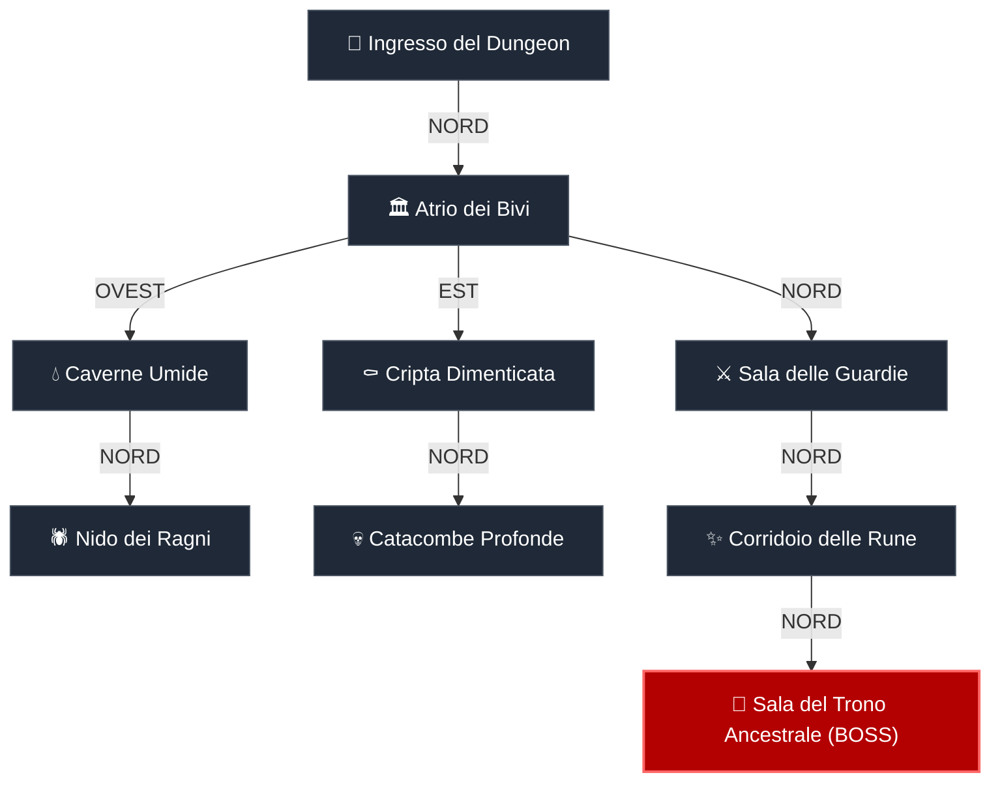

<div align="center">

```text
  ___                                     ____  ____   ____ 
 |   \ _  _ _ _  __ _ ___ ___ _ _  ___   |  _ \|  _ \ / ___|
 | |) | || | ' \/ _` / -_) _ \ ' \(_-<   | |_) | |_) | |  _ 
 |___/ \_,_|_||_\__, \___\___/_||_/__/   |  _ <|  __/| |_| |
                |___/                    |_| \_\_|    \____|
```

### ⚔️ Un Dungeon Crawler GDR tattico a turni per Terminale 🛡️

[](https://www.python.org/)
[](LICENSE)
[](https://github.com/)
[](https://github.com/)
[](https://github.com/)

<p align="center">
  <b>4 Classi Uniche</b> • <b>Risorse Tattiche</b> • <b>Loot Ponderato</b> • <b>Boss a 2 Fasi</b> • <b>Supporto Pixel-Art Terminale</b>
</p>

---

</div>

## 📖 Indice

- [Panoramica del Progetto](#-panoramica-del-progetto)
- [Caratteristiche Principali](#-caratteristiche-principali)
- [Classi e Meccaniche Tattiche](#-classi-e-meccaniche-tattiche)
- [Mappa del Dungeon](#-mappa-del-dungeon)
- [Architettura del Codice](#-architettura-del-codice)
- [Installazione e Avvio Rapido](#-installazione-e-avvio-rapido)
- [Argomenti da Linea di Comando](#-argomenti-da-linea-di-comando)
- [Rendering Grafico & Companion Window](#-rendering-grafico--companion-window)
- [Prossime Idee & Roadmap](#-prossime-idee--roadmap)
- [Licenza](#-licenza)

---

## 🧭 Panoramica del Progetto

**Dungeon RPG** è un gioco di ruolo testuale a scelte sviluppato in **Python puro**, progettato con una separazione architetturale pulita tra logica di gioco (*Game Engine* a stati finiti) e interfaccia utente (*CLI Frontend*).

A differenza dei tipici giochi testuali statici, il sistema offre:
1. **Risorse di combattimento asimmetriche**: Ogni classe non si distingue solo per le statistiche numeriche, ma per un sistema di risorse completamente differente (accumulo di Furia subendo/infliggendo colpi, consumo di Mana con rigenerazione a turno o gestione della Stamina).
2. **Curve matematiche realistiche**: Formule di mitigazione del danno non lineari basate sulla Difesa e progressione esponenziale dell'Esperienza (`formulas.py`).
3. **Loot Table ponderata**: Generazione casuale del bottino basata su pesi e percentuali per rarità (*Comune*, *Raro*, *Leggendario*).
4. **Rendering ibrido intelligente**: Visualizzazione da terminale con barre di progresso ASCII, supporto a **Chafa** per rendering pixel-art o protocollo grafico Kitty e finestra opzionale **Tkinter Companion GUI** per visualizzare gli sprite PNG in tempo reale.

---

## ✨ Caratteristiche Principali

| Caratteristica | Descrizione |
|---|---|
| 🎮 **Combattimento Tattico a Turni** | Attacchi base, abilità speciali di classe, uso di pozioni e tentativo di fuga strategico. |
| 🛡️ **Equipaggiamento Dinamico** | Gestione slot Arma e Armatura con ricalcolo immediato delle statistiche e swap automatico. |
| 🐲 **Incontri & Boss Multi-Fase** | 8 tipologie di mostri con livelli scalati e un temibile **Drago Ancestrale** dotato di 2 fasi di combattimento. |
| 🗺️ **Esplorazione Non Lineare** | 8 aree collegate con bivi a punti cardinali, bivi segreti e tassi di incontro calibrati per zona. |
| 💾 **Serializzazione Completa** | Modelli dati predisposti per salvataggio e caricamento dello stato in formato JSON. |
| 🤖 **Modalità Demo Bot** | Loop automatico con intelligenza decisionale per testare il bilanciamento o eseguire partite dimostrative. |

---

## 🧙‍♂️ Classi e Meccaniche Tattiche

Ogni eroe padroneggia uno stile di combattimento distinto:

| Classe | Risorsa Principale | Meccanica Risorsa | Abilità Speciale | Descrizione Abilità |
|:---:|:---:|:---:|:---:|---|
| **⚔️ Guerriero** | `Furia` (Max 100) | Parte da 0; accumula +15 ad ogni attacco e +10 per ogni colpo subito. | **Colpo Devastante** *(Costo: 40)* | Fendente brutale: infligge `Attacco × 1.8` ignorando il 30% della difesa avversaria. |
| **🔮 Mago** | `Mana` (Max 60+) | Conserva il Mana; rigenera +3 MP ogni fine turno. | **Dardo Arcano** *(Costo: 15)* | Scarica di pura energia: infligge `Attacco × 1.4` penetrando **completamente** la difesa. |
| **🛡️ Cavaliere** | `Stamina` (Max 100) | Gli attacchi consumano 10 Stamina; recupera +20 Stamina a fine turno. | **Baluardo Difensivo** *(Costo: 35)* | Alza lo scudo per 2 turni: +50% Difesa e riflette il 25% del danno incassato al nemico. |
| **🩹 Medico** | `Mana` (Max 70+) | Concentrato sulla sopravvivenza; recupera +2 MP a fine turno. | **Pronto Soccorso** *(Costo: 12)* | Formula taumaturgica immediata: cura istantaneamente il 35% degli HP Massimi. |

---

## 🗺️ Mappa del Dungeon

Il dungeon è composto da 8 stanze connesse. Esplora le ali secondarie per trovare equipaggiamenti rari prima di affrontare il Trono Ancestrale!



---

## 🏗️ Architettura del Codice

Il codice rispetta una rigorosa gerarchia di dipendenze acicliche:

```
dungeon_rpg/
├── config.py         # Costanti di bilanciamento, profili classi ed enumerazioni
├── formulas.py       # Funzioni pure matematiche (mitigazione danno, curve EXP, loot)
├── models.py         # Data classes (Player, Monster, Item, Equipaggiamento, Area)
├── engine.py         # Macchina a stati, gestione turni, inventario e combattimento
├── world.py          # Registrazione di tutti gli oggetti, mostri, aree e tabelle di drop
├── main.py           # Frontend CLI (I/O utente), thread Tkinter opzionale e loop demo
└── assets/           # Risorse grafiche e sprite PNG
    └── monsters/     # Sprite dei mostri in pixel art
```

> [!NOTE]
> **Zero Dipendenze Obbligatorie**: Il gioco funziona out-of-the-box con qualsiasi installazione standard di Python 3.9+.

---

## 🚀 Installazione e Avvio Rapido

### Prerequisiti
- **Python 3.9** o superiore.
- *(Opzionale per rendering pixel art in terminale)*: `chafa`
  ```bash
  # Su Arch Linux / Manjaro
  sudo pacman -S chafa
  # Su Ubuntu / Debian
  sudo apt install chafa
  # Su Fedora
  sudo dnf install chafa
  ```

### Avvio
Clona la repository ed avvia il gioco:
```bash
git clone https://github.com/TUO_USERNAME/dungeon_rpg.git
cd dungeon_rpg
python3 main.py
```

---

## ⚙️ Argomenti da Linea di Comando

Il gioco include flag avanzati per test, benchmark e personalizzazione dell'esperienza:

```bash
# Avvia la partita normalmente
python3 main.py

# Avvia con finestra grafica Companion (richiede Tkinter)
python3 main.py --window

# Esegui una partita bot automatica (classe Guerriero, 60 passi)
python3 main.py --demo --classe guerriero

# Test riproducibile specificando un seed casuale
python3 main.py --demo --classe cavaliere --seed 42
```

---

## 🖼️ Rendering Grafico & Companion Window

1. **Modalità Terminale Pura**: Adattiva su qualsiasi emulatore di terminale con barre di avanzamento grafiche in caratteri Unicode (`[######--------------]`).
2. **Chafa & Kitty Graphics**: Se `chafa` è installato, gli sprite dei mostri vengono rasterizzati direttamente nel terminale in modalità alta definizione o Kitty Graphics protocol.
3. **Companion Window**: Con il flag `--window`, un thread daemon apre una finestra Tkinter sincronizzata che mostra l'illustrazione della stanza e del mostro affrontato.

---

## 💡 Prossime Idee & Roadmap

- [ ] Sistema di Salvataggio e Caricamento rapido su file JSON da menu.
- [ ] Negozio mercante ambulante per acquistare pozioni e vendere bottino in eccesso.
- [ ] Generazione casuale procedurale delle mappe (Dungeon Proc-Gen).
- [ ] Effetti di stato addizionali (Veleno, Stordimento, Congelamento).
- [ ] Supporto sonoro con effetti audio retro via terminale.

---

## 📄 Licenza

Distribuito sotto licenza **MIT**. Consulta il file [`LICENSE`](LICENSE) per ulteriori informazioni.
